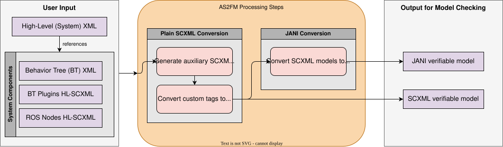

MOdel COmpiler (MOCO)
===============================================

This is the documentation of MOCO, a mantainability fork of AS2FM, originally developed from the `CONVINCE project <https://convince-project.eu/>`_.
Besides illustrative :doc:`tutorials <../tutorials>` on how to use the provided scripts, the :doc:`API <../api>` is documented to foster contributions from users outside of the core project's team.

Overview
--------

The purpose of the provided program is to convert all specifications of components of the given robotic system into a format which can be given as input to model checkers for verifying the robustness of the system functionalities.
It is made to be used with GRAPE and `SCAN <https://github.com/convince-project/SCAN>`_, respectively a development tool and a model checker.

MOCO focuses on converting the model of the system, provided as a combination of `Behavior Tree (BT) XML <https://www.behaviortree.dev/docs/learn-the-basics/xml_format>`_ and :ref:`High-Level (HL)-SCXML<hl_scxml>` into a plain SCXML format that can be used by model checking tools such as SCAN.
A full robotic system and the information needed for model checking consists of:

* one or multiple ROS nodes in SCXML,
* the environment model in SCXML,
* the Behavior Tree in XML,
* the plugins of the Behavior Tree leaf nodes in SCXML,
* the property to check in temporal logic, currently given in JANI, later support for XML will be added.

The full bundle of files is converted to an equivalent model in plain SCXML, which can be directly verified using model checkers such as `SCAN <https://github.com/convince-project/SCAN>`_.

A tutorial on how to use the conversion script can be found in the :doc:`tutorial section <../tutorials>`.

Contents
--------

.. toctree::
   :maxdepth: 2

   installation
   quick-guide
   tutorials
   howto
   scxml-jani-conversion
   api
   contacts
