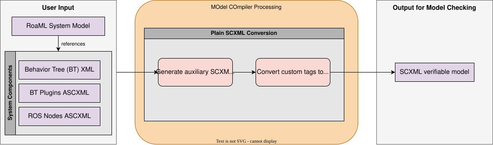

MOdel COmpiler (MOCO)
===============================================

This is the documentation for MOCO, a mantainability fork of AS2FM, originally developed by the `CONVINCE project <https://convince-project.eu/>`_.
Besides illustrative :doc:`tutorials <../tutorials>` on how to use the provided scripts, the :doc:`API <../api>` is documented to foster contributions from users outside of the core project's team.

Overview
--------

The purpose of the provided program is to convert all specifications of components from a given robotic system into a format that can be used with model checkers to verify the robustness of the system's functionalities.
It is intended for use with `GRAPE <https://github.com/NeVerTools/GRAPE>`_ and `SCAN <https://github.com/convince-project/SCAN>`_, respectively a development tool and a model checker.

MOCO focuses on converting the RoaML model of the system into a plain `SCXML format <https://www.w3.org/TR/scxml/>`_ that can be used by model checking tools such as SCAN.
A full RoaML robotic system and the information needed for model checking consists of a folder containing:

* one or multiple ROS nodes in ASCXML,
* the environment model in ASCXML,
* the Behavior Tree in XML,
* the plugins of the Behavior Tree leaf nodes in ASCXML

The full bundle of files is converted to an equivalent model in plain SCXML, which can be directly verified using model checkers such as SCAN.

A tutorial on how to use the conversion script can be found in the :doc:`tutorial section <../tutorials>`.

Contents
--------

.. toctree::
   :maxdepth: 2

   installation
   tutorials
   roaml-scxml-conversion

.. toctree::
   :maxdepth: 1

   api
   contacts
