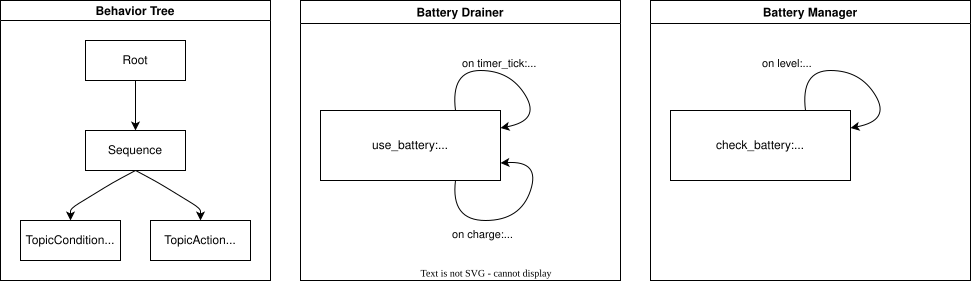

.. _scxml_conversion:

Quick Start
-----------

..

    How to convert from a RoaML model to plain SCXML?

This tutorial explains how to convert an autonomous system specified using the RoaML model into a plain scxml model.
For this tutorial, we assume the system specification is already available. Further explanations on how to specify the system can be found in the `SCXML How-To <scxml_howto>`.

Reference Model: Battery Drainer
`````````````````````````````````

For this tutorial, we use the model defined here: `quick_start_battery_monitor <https://github.com/nevertools/moco/tree/main/examples/quick_start_battery_monitor>`_.
The model consists of a `main.xml` file, referencing the BT files running in the system and the SCXML files modeling the BT plugins, as well as the environment and the ROS nodes.

This example models a simple system with a battery that is continuously drained and, once it reaches a certain level, an alarm is triggered.
A behavior tree continuously monitors the alarm topic and, once it is triggered, recharges the battery to its full level before starting the draining process again.

The image below gives an overview of an exemplary system to be model-checked.



In this example, the system is composed by the following components modeled in SCXML:

* a **Battery Drainer**, that at each time step drains the battery by 1%, and each time the charge trigger is received, it recharges the battery to 100%.
* a **Battery Manager**, that at each time the battery level is received checks if it is below 30% and, if so, triggers the alarm.

The **Behavior Tree** continuously checks the alarm topic and, once it is triggered, sends a charge trigger to the battery drainer.

In the `main.xml file <https://github.com/nevertools/moco/blob/main/examples/quick_start_battery_monitor/main.xml>`_ introduced earlier, the maximum run time of the system is specified with ``max_time`` and shared across the components. To make sure that the model-checked property makes sense, the allowed runtime needs to be high enough to have enough time to deplete the battery, i.e., in this example the maximal time needs to be at least 100s because the battery is depleted by 1% per second. Further information about this and other configuration parameters can be found in the :ref:`Available Parameters section <parameters>` of the :ref:`How-To page <howto>`.

In addition, in this main file, all the components of the example are put together, and the property to use is indicated.


Structure of Inputs
`````````````````````

TODO: Describe the structure of the input RoaML model.

Running the Script
`````````````````````

After installing the package as described in the :ref:`installation section <installation>`, a full system RoaML model can be converted into a model-checkable plain SCXML file as follows:

.. sybil-new-environment: quick_start_battery_monitor
    :cwd: .

.. code-block:: bash

    $ cd examples/quick_start_battery_monitor/ && \
      as2fm_roaml_to_jani main.xml

    MOCO - RoAML to SCXML.

    Loading model from main.xml.
    xml_file='./battery_drainer.ascxml'
    xml_file='./battery_manager.ascxml'
    xml_file='./bt_topic_condition.ascxml'
    xml_file='./bt_topic_action.ascxml'
    ...

The output is a folder (./output, unless otherwise specified) containing the plain SCXML files for the model.