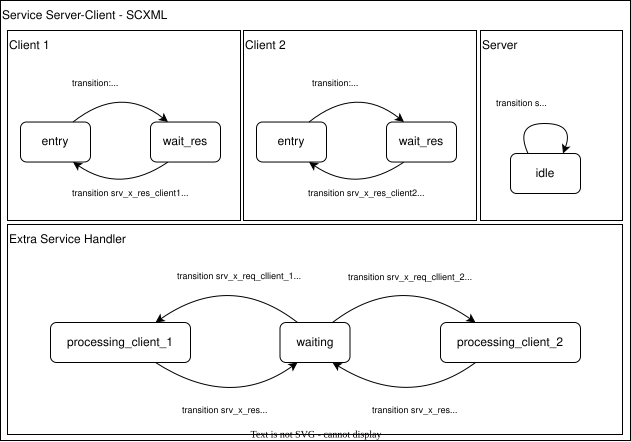
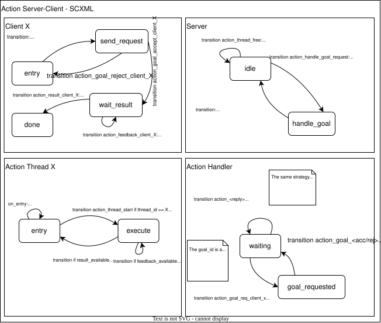

SCXML to JANI Conversion
========================

SCXML and JANI
----------------

Developers using GRAPE and MOCO are expected to use Behavior Trees and SCXML to model the different parts of a robotic systems.

SCXML (State Chart XML) is an XML format that describes a single state machine, and allows it to exchange information with other SCXML state machines using events. Each SCXML file defines its variables (datamodel), states, and transitions.

Using SCXML, the system can be modeled as a set of state machines, each one represented by an SCXML file, which are synchronized together using events. Operations are carried out when the execution of a state machine receives an event, enters a state, or exits a state.

.. _hl_scxml:

High-Level (ROS) SCXML Implementation
---------------------------------------

Input files use an extended ASCXML format defined `here <https://www.w3.org/TR/scxml/>`_ with ROS and Behavior Tree (BT) specific features, to make it easier for robot developers to model their systems using both ROS and BT.

In this guide we will refer to the extended SCXML format as high-level SCXML and to the standard SCXML format as low-level SCXML.

Currently, the supported ROS-features are:

* ROS Topics
* ROS Timers (Rate-callbacks)
* ROS Service
* ROS Actions
* BT Ticks
* BT Responses
* BT Ports
* BT Blackboard

Low-Level SCXML Conversion
----------------------------

Low-Level SCXML is the standard SCXML format defined `here <https://www.w3.org/TR/scxml/>`_.

Our converter is able to transform High-Level (HL) SCXML to Low-Level (LL) SCXML by translating ROS and BT specific features to standard SCXML features.
This applies also for timers: we generate an additional SCXML FSM encoding a global clock, sending out events to trigger the timers defined in the model at the correct rate.

The next subsections describe our conversion strategy from HL-SCXML to LL-SCXML.
The entry-point for the conversion is implemented in ScxmlRoot.as_plain_scxml(). TODO: Link to API.

Handling of (ROS) Timers
__________________________

TODO

Handling of (ROS) Services
_____________________________

ROS services, as well as ROS topics, can be handled directly in the conversion from HL-SCXML to LL-SCXML.

The main structure of the SCXML related state machines can be inspected in the diagram below:

The automata of clients and services are converted directly from the existing ROS-SCXML files, while the "Extra Service Handler" is autogenerated starting from the provided clients' and services' declarations.

Handling of (ROS) Actions
_____________________________

ROS actions are handled similarly to ROS Services: a HL-SCXML description of the system is converted to LL-SCXML, and an additional automaton is generated to handle the synchronization between the clients and the server.

The structure of a client-server communication through actions and additional threads looks as follows:

Handling the BT Blackboard
_____________________________

The Blackboard is a container that shares variables across different BT plugins. The value of those variables normally changes over time, and is expected to be updated at each tick.

In LL-SCXML, this is handled by an autogenerated SCXML FSM, that receives the updates from the various plugins and, upon request, provides the data.
This diagram summarizes the FSM structure.

Setting Blackboard Variables
~~~~~~~~~~~~~~~~~~~~~~~~~~~~~

This can be done using the tag `bt_set_output` in HL-SCXML. In LL-SCXML this translates to a send event, that is received by the Blackboard FSM to update the internal data.

Reading Blackboard Variables
~~~~~~~~~~~~~~~~~~~~~~~~~~~~~

At the current state, to read the internal variables there needs to be some message exchange between the plugin FSM and the Blackboard FSM.
This needs to happen for each and every Blackboard variable that is read.

Optimization is nevertheless possible (sending the whole set of blackboard variables each time), but this would diverge from the Blackboard.CPP implementation, so it should rather be an automatic conversion.