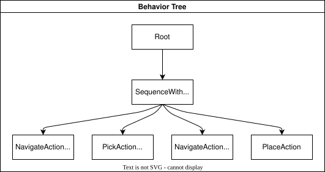
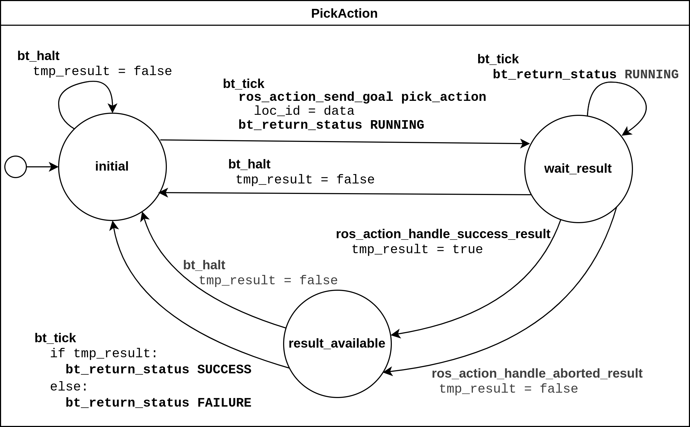
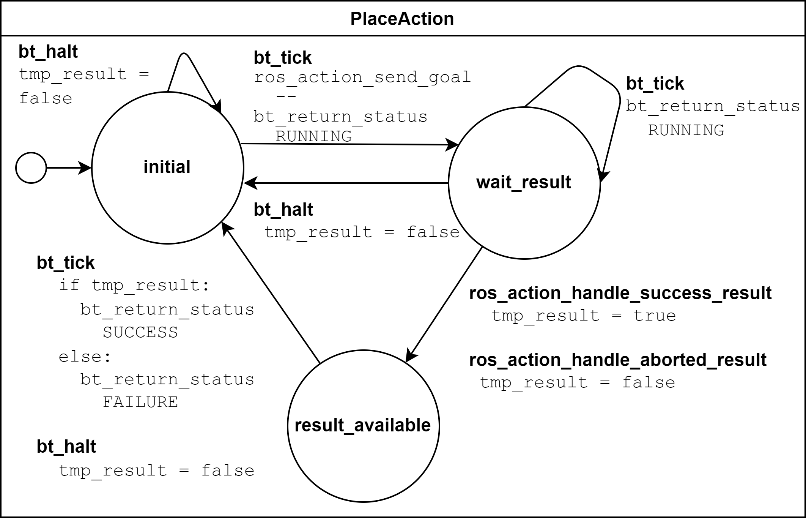

Tutorials
=========

This section provides two tutorials on how to use the MOCO tools to convert an autonomous robotic system into a model compatible with existing model checker tools (such as MOON and SCAN).
The RoaML models generated in the tutorials can be given to any model checker accepting SCXML as input format, but we recommend using SCAN.

The following section assumes you have already installed MOCO and you have cloned the repository files on your working directory.
If you haven't, follow the instructions in the :ref:`installation guide <installation>`.

.. _full_tutorial:

What you will learn
-------------------

In about thirty minutes, you will learn how a robotic example can be expressed in RoaML with ROS and BT tools.
Then, you will use MOCO to translate the model into plain SCXML.

Tutorial: Fetch & Carry Robot
-----------------------------

For this tutorial we use the model defined here: `tutorial_fetch_and_carry <https://github.com/nevertools/moco/tree/main/examples/tutorial_fetch_and_carry>`_.
A classical fetch and carry task is implemented there. A robot should drive to the pantry where food is stored, pick up snacks, drive to the table and place the snacks there. The robot should be done with this task after at most 100 seconds.

The model consists of a `main.xml <https://github.com/nevertools/moco/blob/main/examples/tutorial_fetch_and_carry/main.xml>`_ file, which references the Behaviour Tree (`bt_tree.xml <https://github.com/nevertools/moco/blob/main/examples/tutorial_fetch_and_carry/bt_tree.xml>`_) running in the system and the SCXML files modeling the BT plugins for navigating (`bt_navigate_action.scxml <https://github.com/nevertools/moco/blob/main/examples/tutorial_fetch_and_carry/bt_navigate_action.scxml>`_), picking (`bt_pick_action.scxml <https://github.com/nevertools/moco/blob/main/test/roaml_generator/_test_data/tutorial_fetch_and_carry/bt_pick_action.scxml>`_), and placing (`bt_place_action.scxml <https://github.com/nevertools/moco/blob/main/examples/tutorial_fetch_and_carry/bt_place_action.scxml>`_), as well as the world model (`world.scxml <https://github.com/nevertools/moco/blob/main/examples/tutorial_fetch_and_carry/world.scxml>`_).

We will now take a look at the individual parts of the model:

* First, some parameters configuring generic properties of the system are defined. In this example we bound the maximum execution time to 100 seconds, and configure unbounded arrays to contain at most 10 elements.

    .. code-block:: xml

        <parameters>
            <max_time value="100" unit="s" />
            <max_array_size value="10" />
        </parameters>

* Afterwards, the Behavior Tree is fully specified in the BT.cpp XML format and in the used BT plugins in ASCXML for navigating, picking, and placing. We will go over the individual files later.

    .. code-block:: xml

        <behavior_tree>
            <input type="bt.cpp-xml" src="./bt_tree.xml" />
            <input type="bt-plugin-ascxml" src="./bt_navigate_action.ascxml" />
            <input type="bt-plugin-ascxml" src="./bt_pick_action.ascxml" />
            <input type="bt-plugin-ascxml" src="./bt_place_action.ascxml" />
        </behavior_tree>

* The model of the environment, also known as world, is also given in the ASCXML format, and will be covered later as well.

    .. code-block:: xml

        <node_models>
            <input type="node-ascxml" src="./world.ascxml" />
        </node_models>

The behavior tree specified in `bt_tree.xml <https://github.com/nevertools/moco/blob/main/examples/tutorial_fetch_and_carry/bt_tree.xml>`_ is depicted in the image below. The SequenceWithMemory node ticks each child in order, until all of them have returned Success. Those who already returned Success are not ticked in the next cycle again.
The location is encoded as 0 = in the pantry and 1 = at the table. The snack object has id 0.

The next image depicts the behavior of the BT plugin `bt_navigate_action.scxml <https://github.com/nevertools/moco/blob/main/examples/tutorial_fetch_and_carry/bt_navigate_action.scxml>`_. It is used to navigate to a certain location given by the id, either 0 or 1 in this example, stored in `data`. When the BT is ticked it assigns `loc_id = data`. When the BT is halted or the action is aborted `tmp_result` is set to `false`, otherwise it is set to `true`. Based on that, the return status of the tree is then published.

The next image depicts the behavior of the BT plugin `bt_pick_action.scxml <https://github.com/nevertools/moco/blob/main/examples/tutorial_fetch_and_carry/bt_pick_action.scxml>`_ in a very similar fashion. The action is used to pick a certain item with a given id, stored in `data`. When the BT is ticked it assigns `object_id = data`. When the BT is halted or the action is aborted `tmp_result` is set to `false`, otherwise it is set to `true`. Based on that, the return status of the tree is then published.

The next image depicts the behavior of the BT plugin `bt_place_action.scxml <https://github.com/nevertools/moco/blob/main/examples/tutorial_fetch_and_carry/bt_place_action.scxml>`_. When called, the action just immediately tries to successfully execute, no matter if there is an object in the gripper or not, when the BT is ticked. When the BT is halted or the action is aborted `tmp_result` is set to `false`, otherwise it is set to `true`. Based on that, the return status of the tree is then published.

As a last step, we will take a closer look at the environment model in `world.ascxml <https://github.com/nevertools/moco/blob/main/examples/tutorial_fetch_and_carry/world.scxml>`_.

* First, it states that the model uses the interfaces from the `fetch_and_carry_msgs <https://github.com/nevertools/moco/tree/main/ros_support_interfaces/fetch_and_carry_msgs>`_ package, which defines custom ROS actions. In line 21, the ROS topic publisher for the snack type is declared.

    .. code-block:: xml

        <ros_action_server name="act_nav" action_name="/go_to_goal" type="fetch_and_carry_msgs/Navigate" />
        <ros_action_server name="act_pick" action_name="/pick_object" type="fetch_and_carry_msgs/Pick" />
        <ros_action_server name="act_place" action_name="/place_object" type="fetch_and_carry_msgs/Place" />
        <ros_topic_publisher name="pub_snacks0" topic="/snacks0_loc" type="std_msgs/Int32" />

* The next block defines and initializes the variables used: An array of integers for the objects' locations, an integer for the robot's location, a flag indicating if the robot is holding something (-1 = nothing, otherwise the object's id), a variable saying where the object should be brought to, i.e., the `goal_id`, and two helper variables `req_obj_idx` and `req_loc_idx` for the id of the object which is requested to be picked up and the location to which the robot is requested to navigate to.

    .. code-block:: xml

        <datamodel>
            <data id="obj_locs" type="int32[1]" expr="[0]" />
            <data id="robot_loc" type="int32" expr="1" />
            <data id="robot_holding" type="int32" expr="-1" />
            <!-- Additional support variable for the goal_id -->
            <data id="goal_id" type="int32" expr="0" />
            <data id="req_obj_idx" type="int32" expr="0" />
            <data id="req_loc_idx" type="int32" expr="0" />
        </datamodel>

* The actual functionality of the world model is depicted in the graph below.
    * When trying to navigate to a goal, the location is first stored in the helper variable, and from there the robot location is set to the goal location id. In this file, for the sake of simplicity, it is assumed that this operation always succeeds. 
    * When trying to pick up an object, the requested object's id is stored in a helper variable. Afterwards, it is checked if the object's location is the same as the robot's location. It is recorded in the `robot_holding` variable that the robot now holds the object with a certain id. The location of the object is reset to -1 indicating that it is in the robot's gripper. This procedure can succeed or be aborted. 
    * When checking if an object should be placed, it is checked if the robot is holding one (`robot_holding != -1`). If so, the location of the object is replaced with the robot's location, and `robot_holding` is set to -1 again, as the gripper is now empty. This procedure may also be aborted if it does not succeed (ie. if the robot isn't carrying anything).

    .. image:: graphics/scxml_tutorial_ros_fetch_and_carry_world.drawio.png
        :width: 800
        :alt: An image of the world behavior of the fetch and carry example.

Model Translation with MOCO
---------------------------

You can easily translate this RoaML model in SCXML using MOCO.
Assuming you are in the ``examples/tutorial_fetch_and_carry`` folder:

.. sybil-new-environment: first_model_checking
    :cwd: examples/tutorial_fetch_and_carry

.. code-block:: bash

    $ moco_roaml_to_scxml main.xml

    MOCO - RoAML to SCXML.

    Loading model from main.xml.
    xml_file='./world.ascxml'
    xml_file='./bt_navigate_action.ascxml'
    xml_file='./bt_pick_action.ascxml'
    xml_file='./bt_place_action.ascxml'
    ...

This produces an equivalent model in the plain `SCXML format <https://www.w3.org/TR/scxml/>`_ and saves it to the `./output` folder.
You may specify a different output folder with the `--out` argument (or its' alias `--o`).

Should you wish to learn more about RoaML, its' tags and their handling, check the :doc:`RoaML to SCXML conversion <../roaml-scxml-conversion>`.